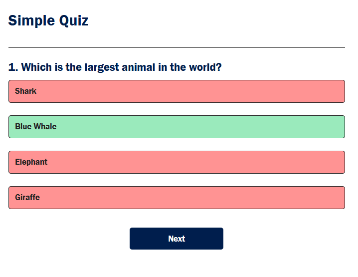

# 📝 Quiz App

An interactive **Quiz Application** built using **HTML, CSS, and JavaScript**.
This project allows users to answer multiple-choice questions and instantly see their final score after completing the quiz.

The goal of this project is to practice **JavaScript logic, DOM manipulation, and building interactive web applications**.

---

## 🚀 Features

* 📌 10 Multiple Choice Questions
* 🎯 Instant Answer Selection
* 📊 Automatic Score Calculation
* 🏆 Final Result Display
* 🔄 Restart Quiz Option
* 💻 Clean and Responsive User Interface

---

## 🛠️ Technologies Used

* **HTML** – Structure of the application
* **CSS** – Styling and layout
* **JavaScript** – Quiz logic and interactivity

---

## 📸 Screenshots

### 🧠 Question Screen



### 🏆 Result Screen


---

## 📂 Project Structure

```
Quiz-App/
│
├── index.html        # Main HTML file (Quiz layout)
├── style.css         # Styling for the application
├── script.js         # Quiz logic and functionality
│
├── question.png      # Screenshot of question screen
├── result.png        # Screenshot of result screen
│
└── README.md         # Project documentation
```

---

## ▶️ How to Run the Project

1. Download or clone the repository

```
git clone https://github.com/your-username/quiz-app.git
```

2. Open the project folder

3. Run the application by opening **index.html** in your browser

---

## 🎯 Learning Objectives

This project helped in learning:

* JavaScript **DOM Manipulation**
* Handling **user interactions**
* Creating **dynamic web applications**
* Structuring **front-end projects**

---

## 🔮 Future Improvements

* Add more quiz questions
* Add timer functionality
* Add category-based quizzes
* Store high scores using Local Storage

---

## 👩‍💻 Author

**Priya**

Aspiring **Software Developer** passionate about **Data Structures & Algorithms (Java) and Web Development**.

---

⭐ If you like this project, consider giving it a **star on GitHub!**
